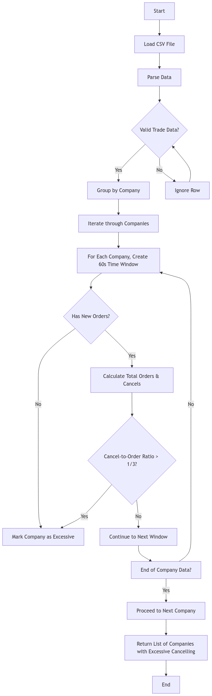
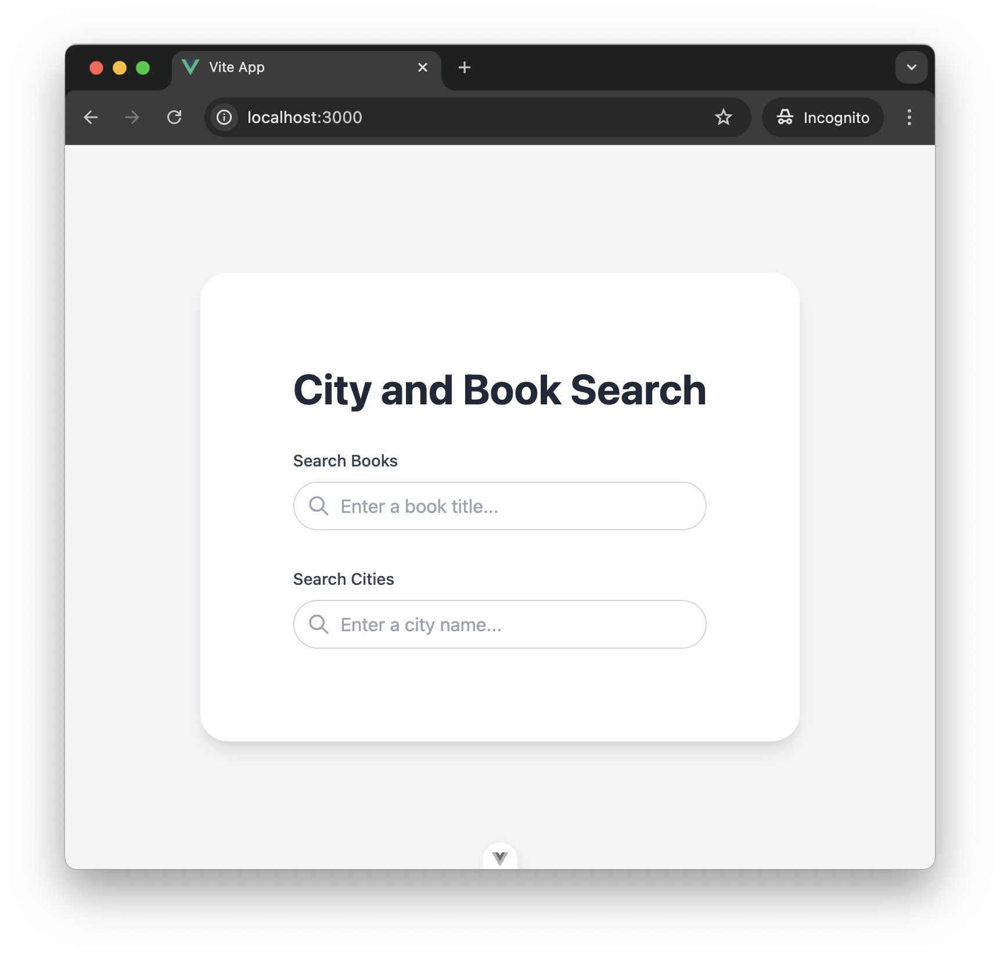

# Full-Stack Project

This project consists of a front-end application built with Vue 3 and a back-end application for processing trade data.


## Back-End Project

The back-end project is focused on processing trade data and identifying excessive trade cancellations.

### Features

- Processes CSV files containing trade messages
- Identifies companies involved in excessive trade cancellations
- Calculates the total number of well-behaved companies

### Getting Started (Back-End)

1. Navigate to the `back-end` directory
2. Install dependencies:

```bash
cd back-end
npm install
```

3. Run the tests:

```bash
npm test
```

### Implementation Details

The main logic is implemented in the `ExcessiveCancellationsChecker` class, which provides the following methods:

- `companiesInvolvedInExcessiveCancellations`: Returns an array of companies engaged in excessive cancelling
- `totalNumberOfWellBehavedCompanies`: Returns the number of companies not engaged in excessive cancelling

The checker processes trade data from a CSV file and analyzes it to determine if any companies are cancelling trades excessively within a 60-second period.

#### isExcessiveCancelling Flow Chart

Below is a flow chart illustrating the logic of the `isExcessiveCancelling` function:




# Front-End Project with Vue 3 / Pinia / Vite / TypeScript 

This project is an example implementation of a front-end application built with modern technologies such as Vue 3, Pinia, Vue Router, and Vite.

### Packages

| Project             | Version   | Links                                           |
| ------------------- | --------- |------------------------------------------------|
| **Vue**             | ^3.4.29   | https://vuejs.org/                             |
| **Pinia**           | ^2.1.7    | https://pinia.vuejs.org/                       |
| **Vite**            | ^5.3.1    | https://vitejs.dev/                            |
| **TailwindCSS**     | ^3.4.12   | https://tailwindcss.com/                       |
| **TypeScript**      | ~5.4.0    | https://www.typescriptlang.org/docs/handbook/  |

## Frontend Screenshot

Below is a screenshot of the frontend application:



# Getting Started

Install `nodejs` on your machine.

Install dependencies with yarn and run the application:

```bash
npm install
npm run dev
```

This will run the application locally on port 4173. To access the application, navigate to:

```sh
localhost:3000
```

# Docker

### Run using Docker Compose

```bash
docker-compose up -d --build
```

Verify the deployment by navigating to your server address in your preferred browser.

```sh
localhost:3000
```

# Testing

### Unit Tests

To run unit tests using Vitest:

```bash
npm run test:unit
```

# Linting and Formatting

To run linting and auto-fix issues:

```bash
npm run lint
```

To format the codebase with Prettier:

```bash
npm run format
```

## Architecture of the Vue Project

- **components/**: All Vue components (inspired by [Atomic Design](https://bradfrost.com/blog/post/atomic-web-design/))

---

Let me know if you need any adjustments!